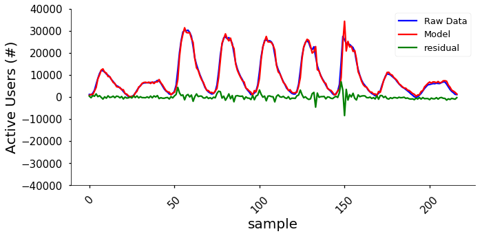
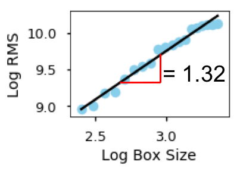

 

# Spike Out 
## A tool to flag anomalous events

----

## **Table of Contents**
  
- [The Problem: Service Interruptions](#heading)
  * [Managing Server Requests](#sub-heading1)
  * [Spike Out](#sub-heading2)
  * [Goals & Questions](#sub-heading3)
  * [Solutions to the problem](#sub-heading4)
    +  [Pros and Cons](#sub-sub-heading1)
- [The Data](#heading-1)
  * [Time Series](#sub-heading-11)
  * [Data Challenges and Exploration](#sub-heading-12)
- [Models](#heading-2)
  * [ARIMA](#sub-heading-21)
  * [ARIMAX](#sub-heading-22)
      + [Feature Engineering](#sub-sub-heading-221)
  * [LSTM](#sub-heading-23)
      + [Long-range correlations](#sub-sub-heading-231)
      + [LSTM creation](#sub-sub-heading-232)
- [Validation](#heading-3)
  * [Multiple Train-Test Splits](#sub-heading-31)
- [Results](#heading-4)
- [Conclusions](#heading-5)
  * [Future Work](#sub-heading-51)

----

## The Problem: Service Interruptions
Business' use websites as a tool to interact with their users. When a website's service is unavailable it cost the [business revenue](https://www.forbes.com/sites/kellyclay/2013/08/19/amazon-com-goes-down-loses-66240-per-minute/#6c0b5db5495c). It becomes imperative that business' can maintain their website from service interruptions and to constantly be in connection with their customers. However, there are moments when unseen circumstances lead to sharp changes in users visiting the website. These sharp changes can be understood as anomalous spikes in the typical daily trends of webpage visits. Forecasting anomalies can lead to efficient server management. More specifically, it can allow web server companies to reduce service interruptions, by knowing in advance whether there is a pressing need to accomodate more server requests. 

### Managing Server Requests
Currently, servers are designed accomdate requests up to a limit. A pre-determined limit on the number of requsts is set by web server manager at which point the server stops recieving requsts and forms a [cue.](https://serverfault.com/questions/140897/how-does-too-many-requests-make-a-server-crash/) As a result a user will often see a browswer response that reads "503 Service Unavailable". For the purpose of this context we are focusing on legitimate requests to the website and not another instance of this occurrence that is known as a denial-of-service attack [(DOS).](https://en.wikipedia.org/wiki/Denial-of-service_attack) Assuming that the requests are legitimate and despite their best-efforts to set the limit appropriately, web sites have still have service interruptions in recent historytrum.

### Spike Out
Spike Out is a tool which uses residuals from model to flag anomalous activity with website visitors. Spike Out is a project I attemped as data science fellow at Insight Data Science. 

### Goals & Questions
1) Find model that captures dynaimcs of web-traffic accurately.
  - What is the most approproate time-series models to capture the dynamics of web-traffic data?
2) Predict/Flag anomalous events in the data based on a selected threshold.
  - Based on the current data, what is the best threshold approach?

### Potential Solutions to the problem
1) Use a static threshold based on typical peak activity. 
2) Use residuals from model to detect change in webtraffic behaviour. 

#### Pros and Cons
For __solution 1__, captuing the peaks can allow us to use forecasted values on the actual data to predict a potential anomalies. In this case we are limiting the lag time between the detection of an anomaly and action to handle the anomaly. However, there is the question of what peaks are typical and atypical. This choice can potentially inflate the threshold and lead to prediction of false negatives (i.e., missing true anomalies). From a business perspective this approach does allow potential savings but being premptive but limits the accuracy of detecting anomalies and can potentially be a risk for adding costs than actual savings.

For __solution 2__, using the residuals inherently places emphasis on modeling the data accurately. Assuming the data can be modeled accurately a second limitation is the lag betwen detection and action. More specifically, as time progresses obersvations will get added to the data and the residual between the actual and predicted value will then inform action. From a business perspective this does lead to a cost because newly acquired data can be anomalous and therefore action will occur after the start of an anomalous event.

----

## The Data
Publicly available web traffic data is made accessible through analytics.usa.gov. A description of the initiative can be found at [DAP](https://www.digitalgov.gov/services/dap/). The site reports various metrics (i.e., active users) of a number of governmental websites every 5 minutes. Here is an example of the obtainable .csv file made by the website on “active users”:

A definition of "active Users" could not be found on the description of the initiative. The working defintion of for active users (AU)  for this analysis is: users that navigated to the page of interest and also navigated to a corresponding link on the page of interest. 

I captured the data every 5 minutes without delay for 18 days in an AWS server. Below is the data pipeline I created:

To narrow the field of websites being reported by analytics.usa.gov/, I decided to cut out url’s that were not home pages, such as:

1)	usps.com/
2)	weather.gov/
3)	medicare.gov/
4)	nasa.gov/
5)	irs.gov/
6)	cdc.gov/
7)	defense.gov/
8)	ssa.gov/
9)	va.gov/
10)	usajobs.com/

### Time Series
When plotting the time series of the tracked websites we immediately notice the presence of weekly trends in the data. To be more specific, the peak number of users during the weekdays are greater than on the weekends.  We also see that the time series is fairly stationary (i.e., does not have a changing mean over time). An augmented Dickey-Fuller test (ADF) provides a confirmation of this observation. 

These types of websites serve as a prime example of why server management system would place a pre-determined limit on the number of requests a website should accommodate. However, what’s of interest is the spike in activity that occurred during the government shutdown. 

Below is the univariate time series data for usps.com/:

Looking at the data we notice there are clear spikes in the data that are event-related such as, 1) government-shutdown and, 2) the release of a stamp dedicated to Lena Horne. 

The usps.com/ data will be used for demonstrating the analysis performed in this blog. Specifically the clip of data used to model the dynamics web-traffic is in red. The green will be used to test out of sample predictions.

### Data Challenges and Exploration
Exploration of the data took several parts:
1) Checking the sampling was consistent.

The figure on top demonstrates that the sampling was not consistent. Therefore, I aggregated that data by the hour, by summing the number of visotors within each hour. This did reduce the number of data points substantially but, I chose this method instead of using the mean because it would add an artifact (spike) to the data. 

2) Assesing the stationarity.

A fairly consisten mean and variation were present, but clear weekday/weekend trends are present.

3) Evaluating the structure. 

Clear structure is present in the data demonstrating non-random process.

## Models
Due to exploratory steps taken to above understand the data, the first attempt at modeling web-traffic was with the Autoregressive Integrated Moving Average (ARIMA) and its variation ARIMAX models. Additional analysis of the data lead to the use of an variation of a recurrent neural network (RNN) called the long short-term memory (LSTM) neural network. 

### ARIMA
The ARIMA model can be described as an extension to regression, which uses the weighted sums of lags (AR parameter) combined with weighted sum of errors (MA paramter). The parameters of an ARIMA can be guided by the partial autocorrelation (PACF) and autocorrelation (ACF) functions for the AR (lag feature) and MA (error feature) parameters, respectively. Alternatively, a grid search can be performed. The PACF and ACF were used to guide the choices of parameters. The parameters for the model used were AR(2), MA(5). When fitting the model the ARIMA tended to have a poor fit. 

### ARIMAX
The ARIMAX is an extension to the ARIMA which includes a exogenous covariates. The covariate is combined with the linear equation as a weighted value. The inclusion of a covariates changes the data to a multivariate dataset. 
#### Feature Engineering
In order to establish a covariate with the data I thought to encode the dates of government shutdown. In order to verify that the government shutdown was an appropriate covariate, I performed a Granger Causality test. A significant F-test was found showing that the government shutdown is a predictor of active users. The opposite was also tested (i.e., whether active users drive the shut down) and was found to be not significant. ` 

Government shutdown driving active users:

Active useres driving government shutdown:

Following the inclusions of the feature in the dataset and then fitting an ARIMAX model the fit become much better at capturing the dynamics of the time series. 

### LSTM
#### Long-range correlations
Many complex and dynamical systems possess memory, more specifically called long-range correlations. This idea in a time series can be understood as the variabilty at short time scales being correlated to the variabilty at large time scales. One method for establishing the presence of long-range correlations is with a detrended fluctuation analysis (DFA). More details on the procedure can be found [here](https://www.physionet.org/physiotools/dfa/)

After plugging the time series into the DFA algorithm the data produced a fractal scaling index (FSI) of 1.32. The FSI is calculated by taking the slope of the log-log plot of the window size versus mangitude of fluctuation. For context the fracal scaling index can range from 0-2. An FSI > 1.0 is indication of a long-range correlations. 

With the presence of long-range correlations it became clear that and LSTM model would be appropriate since it can capture long-range dependencies in time series. 

#### LSTM creation
The LSTM model in the 

## Validation
### Validation using multiple Train-Test Splits
Validation in machine learning is typically done with cross-validation. Due to the fact that time series data has temporal connections a typical cross-validation technique is insufficient for testing out the 

Multiple train test splits were used to validate the model. The approach takes a fixed testing length and uses various sizes of the training data to predict the test set. 

## Results
The results of the trian-test splits indicate that the LSTM model performs the best at predicting testing data with various lengths of training data. 

Finally to test whether the LSTM on detecting a spike the data, the peaks (blunted if a spike to avoid skew), was used to define the median. The 75 percentile was then used as the threshold. 

The 75th percentile corresponded to 30298 active users and the predicted value of the timestep at the spike was 30500 active users. According to that threshold and prediction algorithm accurately predicted a spike occurence. 

## Conclusions
Spike Out is currently a proof-of-concept tool which provides a basis for detecting anomalies in web-traffic data. Event-related features show drastic changes in the ability to model active users on websites. Additionally, the LSTM approach shows the best ability to model web-traffic data, partly due to the presence of long-range correlations. The small sample of spikes with the present dataset limited a true test of anomaly detection reliability. However, at first pass the tool appears functional with the current forecasting approach. As a whole, Spike Out adds value to a web server management systems by provding an indication of potential future anomalies based on current and previous web-volume and additional features. 

### Future Work
Future work will aim to capture more data in order to turn the anomaly detection method into a classification problem. This will allow the tool to be tested using a true machine learning approach. Additionally, with an appropriate resolution in sampling (i.e., non-aggregated data), a more sensitive approach for detecting anomalies would be to measure the slope of several forecasts. This is becasue spikes typically have a sharper rise than typical volume rises observed in daily web volume. Lastly, this tool can be expanded by including additional event related features as an automated method by sourcing website related trends, such as tweets, news headlines, and google search results. 

